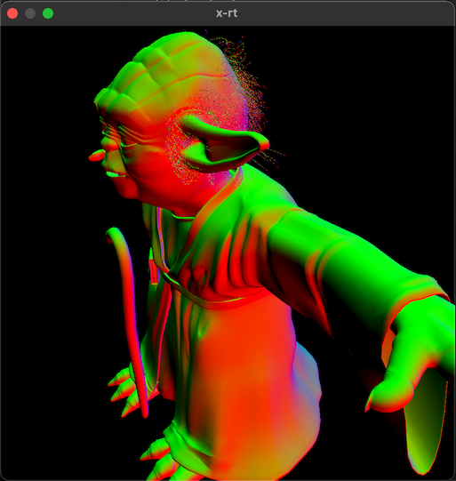

I'm learning computer graphics by watching the [**a l a r m i n g l y well produced** recorded lectures](https://www.youtube.com/playlist?list=PLplnkTzzqsZS3R5DjmCQsqupu43oS9CFN) by [Cem Yuksel](http://www.cemyuksel.com/) for University of Utah's [Interactive Computer Graphics CS 5610/6610](https://graphics.cs.utah.edu/courses/cs6610/spring2022/).

This repository contains my attempt to complete the projects associated with the course.

> :exclamation: **_WARNING:_** Developed and tested *ONLY* on Metal 3 (MacOS Ventura Beta 4, Xcode 14 Beta 4, MacBook Pro M1 Max). Outside of this setup, I have no idea whether any of this code works.

# [Project 1: Hello World](./proj-1-hello-world/)

- Render something!

# [Project 2: Transformations](./proj-2-transformations/)

- Transform model vertex coordinates to to normalized device coordinates
- Toggle between Orthographic and Perspective Projection

# [Project 3: Shading](./proj-3-shading/)

- Ambient, Diffuse, and Specular Shading

# [Project 4: Textures](./proj-4-textures/)

- Load and render model materials

# [Project 5: Render Buffers](./proj-5-render-buffers/)

- Render to a texture, then render that texture to a plane
- Toggle between different texture sampling modes
    - Nearest
    - Bilinear
    - Trilinear
    - Anisotropic

# [Project 6: Environment Mapping](./proj-6-environment-mapping/)

- Render an environment (skybox) using a cube texture
- Render model and plane with perfect, mirror-like material
- Render model's reflection onto the plane

# [X-Project 6: Ray Traced Reflections/Environment Mapping](./proj-6-ray-traced-reflections/)

Alternate implementation of Project 6 using Ray Tracing.

- Render model and plane using multi-bounce (4) ray tracing
    - **Unlike original Project 6, the model reflects on itself!**
- Render laser pointer to visualize ray tracing

# [Project 7: Shadow Mapping](./proj-7-shadow-mapping/)

- Render shadows of a model onto itself and a plane below it
- Use a Shadow Map (Depth texture)

# [X-Project 7: Ray Traced Shadows](./proj-7-ray-traced-shadows/)

Alternate implementation of Project 7 using Ray Tracing.

- Render shadows of a model onto itself and a plane below it
- Use a Ray Tracing

# [Project 8: Tesselation](./proj-8-tesselation/)

- Normal Mapping
- Displacement Mapping with Tesselation Shaders

# [X-Project: Ray Tracing](./x-rt/)

- Basic Ray Tracing (Primary Ray) rendering a model's normals
- Uses an Acceleration Structure with embedded normals for each triangle primitive
- Goals
    - Learn the basics of using the Metal Ray Tracing APIs and XCode's Acceleration Structure tooling.
    - Develop [`metal-app/ModelAccelerationStructure`](./metal-app/src/model_acceleration_structure.rs)
    API for loading a model's geometry into a Metal Acceleration Structure
        - Used by [X-Project 6](./proj-6-ray-traced-reflections/) and [X-Project 7](./proj-7-ray-traced-shadows/)

# Implementation

Hold on to your butts....

I'm trying to learn new stuff on top of new stuff.

- [Rust](https://www.rust-lang.org/)
- [Apple Metal](https://developer.apple.com/metal/)
    - [metal-rs](https://github.com/gfx-rs/metal-rs) Crate for Rust/Metal bindings
        - [Forked with some Metal 3 additions](https://github.com/gfx-rs/metal-rs/compare/master...peterwmwong:metal3-raytracing)
    - Metal 3 techniques used
        - [Bindless Argument buffers](https://developer.apple.com/videos/play/wwdc2022/10101/)
        - [Faster Resource Loading with MTLIO](https://developer.apple.com/videos/play/wwdc2022/10104/)
            - [asset-compiler crate](./asset-compiler/)
                - Cube Textures (ex. [Project 6: Environment Mapping](./proj-6-environment-mapping/))
                    - Build/compile time, cube face textures are compiled into a directory of `lz4` compressed textures using Metal 3's [MTLIO Compression Context](https://developer.apple.com/documentation/metal/3951235-mtlioflushanddestroycompressionc)
                    - Run time, cube faces are loaded into a cube texture using Metal 3's [MTLIO Command Buffer](https://developer.apple.com/documentation/metal/resource_loading)
        - Coming soon: [Offline Native Shader Compilation/Loading](https://developer.apple.com/videos/play/wwdc2022/10102/)

# Common Project Architecture

> TODO: Document `metal-types`/`metal-build` crates and how data structures are shared between Metal and Rust

> TODO: Document how `metal-build` provides `build.rs` support for each project to precompile shaders

> TODO: Document `metal-app`, especially [RenderPipeline](./metal-app/src/pipeline/render_pipeline.rs) and Binds for simplifying and removing/reducing errors when setting up simple to complex (ex. depth/stencil, multiple sub-passes, many binds) render pipelines.

# Performance

See [performance.md](./performance.md) for more in-depth documentation on workflows and tooling for assessing performance.
