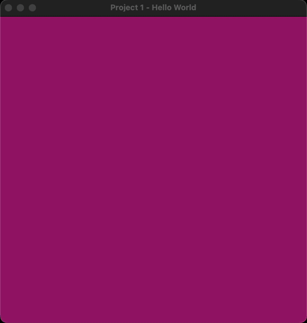

I'm learning computer graphics by watching the [**a l a r m i n g l y well produced** recorded lectures](https://www.youtube.com/playlist?list=PLplnkTzzqsZS3R5DjmCQsqupu43oS9CFN) by [Cem Yuksel](http://www.cemyuksel.com/) for University of Utah's [Interactive Computer Graphics CS 5610/6610](https://graphics.cs.utah.edu/courses/cs6610/spring2022/).

This repository contains my attempt to complete the projects associated with the course.

# Implementation

Hold on to your butts....

I'm trying to learn new stuff on top of new stuff.

- [Rust](https://www.rust-lang.org/)
- [Apple Metal](https://developer.apple.com/metal/)
    - [metal-rs](https://github.com/gfx-rs/metal-rs) Crate for Rust/Metal bindings
        - [Forked with some Metal 3 additions](https://github.com/gfx-rs/metal-rs/compare/master...peterwmwong:metal3)
    - Metal 3 techniques used
        - [Bindless Argument buffers](https://developer.apple.com/videos/play/wwdc2022/10101/)
        - Coming soon: [Faster Resource Loading with MTLIO](https://developer.apple.com/videos/play/wwdc2022/10104/)
        - Coming soon: [Offline Native Shader Compilation/Loading](https://developer.apple.com/videos/play/wwdc2022/10102/)

# Common Project Architecture

> TODO: Document `metal-types`/`metal-build` crates and how C++ structures are shared between Metal and Rust

> TODO: Document how `metal-build` provides `build.rs` support for each project to precompile shaders

> TODO: Document `metal-app`

# Performance Workflows

Beyond meeting the project requirements, I want a better understanding of how I would squeeze every single cycle of performance in this new world.

## GPU Frame Capture and Profiling

> TODO: Document motivation and usage of `xcode-project` and `open-xcode` VScode tasks

## Memory Leak/Profiling

> TODO: Document motivation and usage of XCode Instruments Memory Leaks Template from `xcode-project`

## CPU Profiling

> TODO: Document motivation and usage of XCode Instruments Metal Template from `xcode-project`

## CPU Assembly Diffing

> TODO: Document motivation and usage of `scripts/asm-gen.sh`, `scripts/asm-diff.sh` and associated VSCode tasks

## Metal Shader AIR Assembly Diffing

> TODO: Document motivation and usage of VSCode tasks `compile-and-emit-shader-asm` and `diff-shader-asm`

## TODO: Build Performance

> TODO: Review https://nnethercote.github.io/perf-book/compile-times.html

# [Project 1: Hello World](./proj-1-hello-world/)

- Render something!

# [Project 2: Transformations](./proj-2-transformations/)

- Transform model vertex coordinates to to normalized device coordinates
- Toggle between Orthographic and Perspective Projection

# [Project 3: Shading](./proj-3-shading/)

- Ambient, Diffuse, and Specular Shading

# [Project 4: Textures](./proj-4-textures/)

- Load and render model materials

# [Project 5: Render Buffers](./proj-5-render-buffers/)

- Render to a texture, then render that texture to a plane
- Toggle between different texture sampling modes
    - Nearest
    - Bilinear
    - Trilinear
    - Anisotropic

# [Project 6: Environment Mapping](./proj-6-environment-mapping/)

- Render an environment (skybox) using a cube texture
- Render model and plane with perfect, mirror-like material
- Render model's reflection onto the plane

# [Project 7: Shadow Mapping](./proj-7-shadow-mapping/)

- Render shadows of a model onto itself and a plane below it
- Use a Shadow Map (Depth texture)

# Project 8: Tesselation (coming soon)